# Schema

Schema is use to validate incoming body json data.
It is a PHP associative array that describes the structure of the incoming data.
For exemple, we expect on /api/v1.0/produit/listone?id=1 to receive an id parameter with that structure :

```php
[
    'id' => [
        'type' => 'integer', // id is an integer
        'required' => true, // id is required
        'range' => [1, null] // 1 to infinity
    ]
]
```

## Template

Template is just a class that verify the structure of the schema, i think i'll delete it in the future.
It is internally used by the schema class. So you don't have to worry about it. It is pretty independent so deletable without any problem.

## Validators

Validator is a class with a validate method that validate the data.
It is a rule ( required rule, not blank rule, type rule ect)
It return a ValidatorResult object with a formated result ( getResult())

ValidatoError is deletable as he is poor boiler plate code.

## Core

Validators barrel file and some sorting functionnality with private constants.
Schema use core to distribute the data to the validators.

```mermaid
flowchart RL
    A[Core] --> B[Schema]
    C[Validators] --> A
    B --> H([output 😍])
    G([input 🤢]) --> B
```


